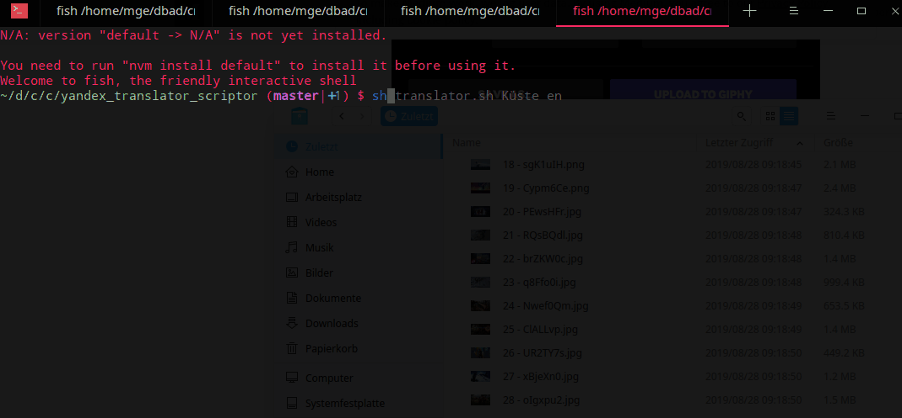

# yandex_translator_scriptor
Das ist ein Script welches man benutzen kann um input in eine gezielte oder in eine random Sprache zu übersetzen

Syntax: sh translator.sh `<input>` (mandatory) `<sprache>` (optional)

*  sh translator.sh hallo de --> übersetzt hallo ins deutsche
*  sh translator.sh hallo --> übersetzt hallo in eine random sprache
*  Sätze werden mit + Zeichen getrennt
    * sh translator.sh hallo+wie+geht+es+dir en --> übersetzt hallo wie geht es dir ins englische

ACHTUNG: Es muss vorher ein API Key unter https://translate.yandex.com/developers/keys erstellt werden und im Skript unter Key eingefügt werden.
Der eingetragene Key funktioniert nicht

PS: Ihr benötigt xclip, bzw ersetzt xclip im Skript mit eurem Clipboard Manager der Wahl, falls ihr einen anderen habt

Unten seht ihr ein gif wie das aussieht in Aktion

